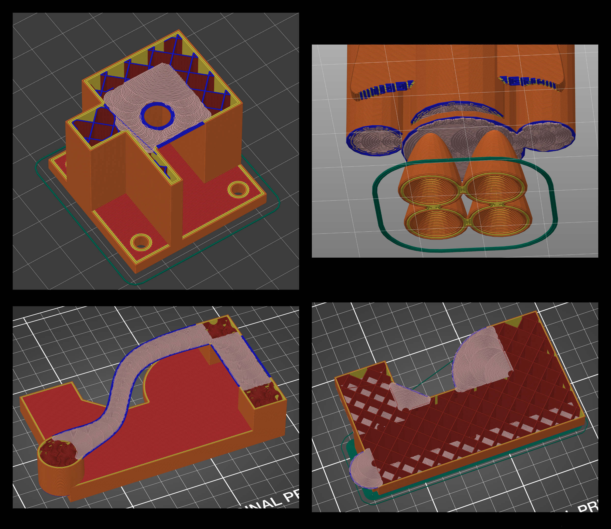
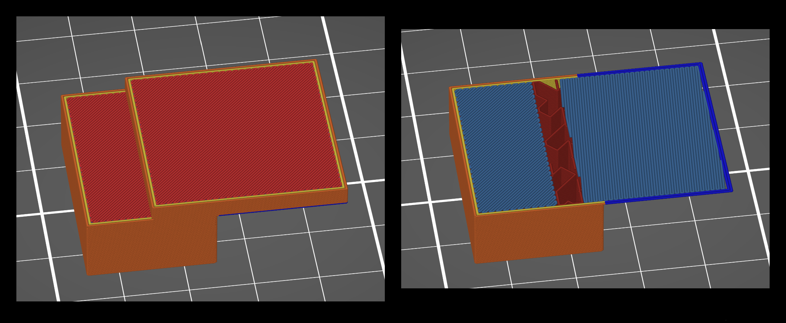
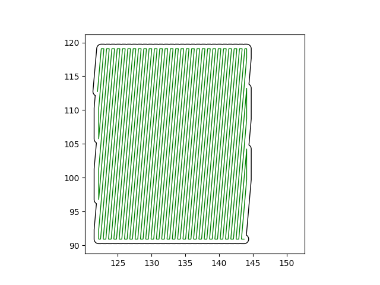
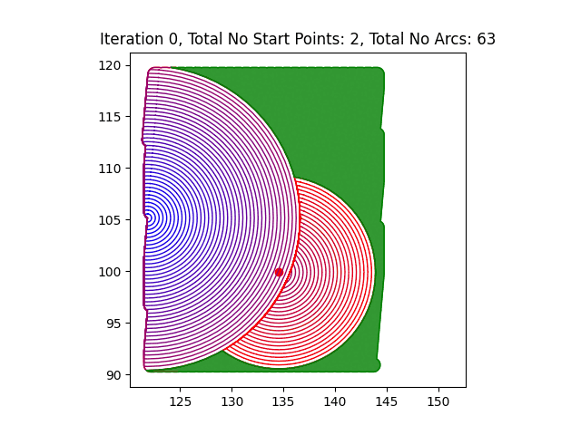
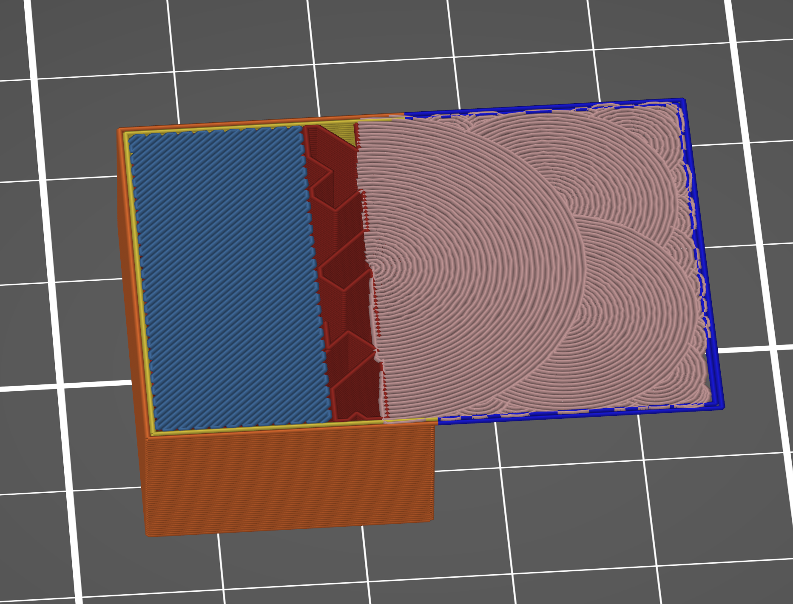

# Arc Overhang

  

A 3D printer toolpath generation algorithm that lets you print up to 90° overhangs without support material, original Idea by Steven McCulloch: https://github.com/stmcculloch/arc-overhang

**Now it is easy and convinient to use by integrating the functionality into PrusaSlicer as a post-processing script.**

Steven and I hope that some day this feature gets integrated into slicing software. But until then you can use this script to get the added functionalitiy today!

## 0. Videos

- Arc Overhang Initial Video: https://youtu.be/fjGeBYOPmHA
- CNC kitchen's video: https://youtu.be/B0yo-o47688
- Steven's Instagram: https://www.instagram.com/layershift3d/

This is a basic visualisation how the algorithm works: 

(this visualisation uses depth first generation, the current version uses breadth first search algorithm to fill the remaining space in the overhang.
## 1. Brief Explanation (from Steven McCulloch):

1. You can print 90° overhangs by wrapping filament around itself in concentric **arcs**. You may have seen the [fullcontrol.xyz overhang challenge](https://fullcontrol.xyz/#/models/b70938). This uses the exact same principle.
Here's what this effect looks like while printing:  

2. You can start an **arc** on an **arc** to get ridiculously large overhangs.
To get perfect results you need to tune the process to fit your machine. Also it is painfully slow, but still faster than support + removal :P

For more details visit: https://github.com/stmcculloch/arc-overhang
## 3. Setup-Process
1. download and install Python 3, at least Version 3.5, check the "add to PATH" box during the installation.
2. install the librarys [shapely](https://shapely.readthedocs.io/en/stable/), [numpy](https://numpy.org/) and [matplotlib](https://matplotlib.org/) via "python -m pip install "+library-name in your console (type cmd in start-menu search).
3. Ready to go!

## 4. How to use it:
#### Option A) via Console
Simply open your system console and type 'python ' 
followed by the path to this script 
and the path of the gcode file. Will overwrite the file.
#### Option B) use it as a automatic post-processing script in PrusaSlicer
1. open PrusaSlicer, go to print-settings-tab->output-options. Locate the window for post-processing-script. 
2. In that window enter: full-path-to-your-python-exe full-path-to-this-script-incl-filename
3. PrusaSlicer will execute the script after the export of the Gcode, therefore the view in PrusaSlicer wont change. 
4. Open the finished gcode file to see the results.

Notes to nail it first try:
If the python path contains any empty spaces, mask them as described here: https://manual.slic3r.org/advanced/post-processing

If you want to change generation settings: Open the Script in an editor, scroll to 'Parameter' section. Settings from PrusaSlicer will be extracted automaticly from the gcode.

## 5. Current Limitations
1. Some settings need to be taylored to your specific geometry, just like you adapt the settings in your slicer. Details below.
2. Code is slow on more complicated models, but is not optimized for speed yet.
3. The Arcs are extruded very thick, so the layer will be 0.1-0.5mm thicker (dependend on nozzle dia) than expected
=>if precision needed make test prints to counter this effect.
4. when next layers are added: Heavy warping, locking for way to fix it. Message me or Steven if you have an Idea :)
5. no wiping or z-hop during travel moves
6. remaining print time shown during printing is wrong. The real printtime can be seen when opening the finished file in GcodeViewer.
7. will take the first island of the prev. perimeter as a startpoint. If you dont like that point, turn the models along z-axis.
8. Physics: The arcs need to be able to support their own weight without much deformation. Therefore narrow and long bridges will be generated, but not print successfull. Use some supports to stabilize critical areas.

## 5.1 Updates:
Warping reduced by turning the fan of for the next few layers and printing them slow to. Turned into sagging, was a little much, working my way up again :)
Details results follow. But good news is: The problem seems solvable!

  

## 6. Suggested Print Settings
Some PrusaSlicer PrintSettings will be checked and warned if "wrong".

Reduce Warping:
Recommended in the Arc-Overhang area: only 1 bottom layer, infill: less is better, avoid straight lines, e.g. hilbert-curve.
### Important Settings in the Script are:

a) **"ArcCenterOffset":** The surfacequality is imporved by Offsetting the arc center, because the smallest r is larger->more time to cool. Set to 0 to get into delicate areas.

b) **"ExtendIntoPerimeter":** Enlargen the Area, where Arcs are Generated. Increase to thicken small/delicate passages. minValue for the algorithm to work is 0.5extrusionwidth! 

c) **"MaxDistanceFromPerimeter":** Controls how bumpy you tolerate your edge. big: less tiny arcs, better surface. small:follow the curvature more exact.

d) Thresholds for area and bridging length, adjust as needed, but Arc shine at large surfaces :)

### General Print Settings: 
The overhang print quality is greatly improved when the material solidifies as quickly as possible. Therefore:
  
1. **Print as cold as possible.** I used 190 degrees for PLA. You can probably go even lower. If you require higher temp for the rest of the print, you could insert could insert some temp-change gcode before and after the arcs are printed. Might waste a lot of time though.
   
2. **Maximize cooling.** Set your fans to full blast. I don't think this technique will work too well with ABS and materials that can't use cooling fans, but I haven't tested it.
3. **Print slowly.** I use around 2 mm/s. Even that is too fast sometimes for the really tiny arcs, since they have almost no time to cool before the next layer begins.

## 6.1 Examples:

  

## 7. Room for Improvement
We would be happy if you contribute!
Currently the biggest issue is severe warping, when the infill layers above are printed. Do you have Suggestions? Update above.
The surface-finish seems to be better with using as little as possible start points for the arcs. but where are the Limits? Finding an algorithm deciding when to start a new arc, working reliable an a wide set of geometrys is the next ongoing developement.

Printing long overhangs is tricky due to gravity. a meet in the middle concept could help, but how do we teach that to the computer?
Feel free to encorporate any Ideas in the post-processing script and try them!

Further optimize the settings or add features like z-hop.
You could reduce warping by automaticly slowing down in the next few layers (eg 2mm).

## 8. Printer Compatibility

By default, the output gcode should print fine on most standard desktop FDM printers you can use with PrusaSlicer. PrusaSlicer is mandatory as the script listens to sepcific keywords....

## 9. Easy Way to try Out

If you want to try the prints without installing, Steven and I added some test print gcode files in the root directory that you can directly download. They should print fine on most printers although you may need to manually adjust the gcode so that it works with your printer.

## 10. Print it! 
If you get a successful print using this algorithm, I'd (and I am sure Steven to) love to hear about it.

## 11. How the Post-Procssing-Script works
The script analyses the given gcode-file and splits it into layers. For every layer the informations are saved as an object (Class:Layer).
Than it searches for "Bridge Infill" tag in the gcode, kindly provided by PrusaSlicer.

The process will be shown with this simple example geometry(left). It has Bridge Infill at 2 areas in one layer, the right one is the overhang we want to replace.(right)

The real work is done by the shapely-Library. The Algorithm extracts the gcode and converts it into a shapely line (plot:green). By thickening the line we get one continous Polygon(plot black):

The Polygon is verified by several steps, including touching some overhang perimeter.
To find a start point the external perimeter of the previous layer is extracted and the intersection area with our Polygon calculated.
The commom boundary of the intersection area and the Polygon will be the startline (magenta) for the arc generation.

For each step concentric arcs are generated, until they hit a boundary or rMax. The Farthest Point on the pervious arc will be the next startpoint.

The process is repeated until all points on the arcs are close enough to the boundary or overprinted by other arcs.
Finally the gcode file will be rewritten. All infos are copied and the Arcs are injected at the beginning of the layer. the replaced bridge infill will be excluded:

