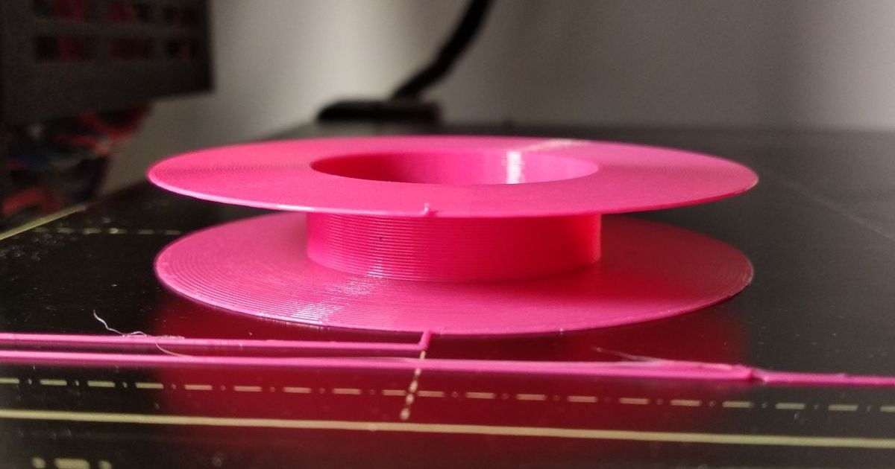
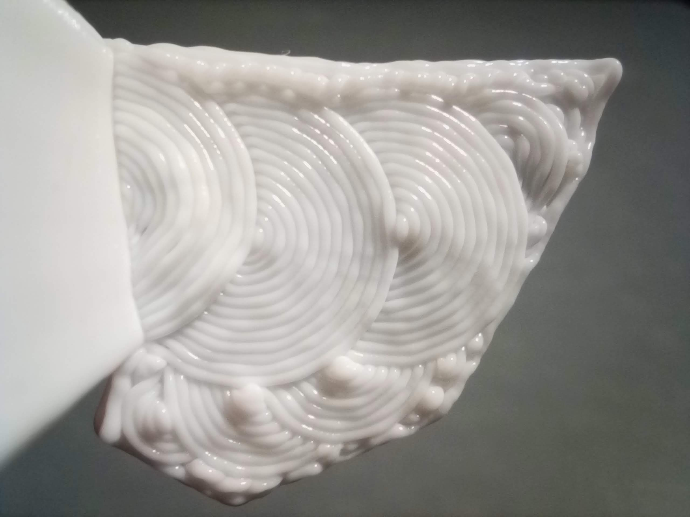
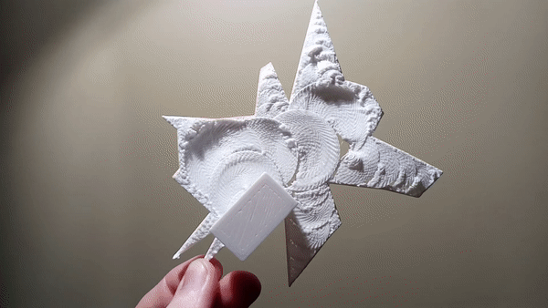
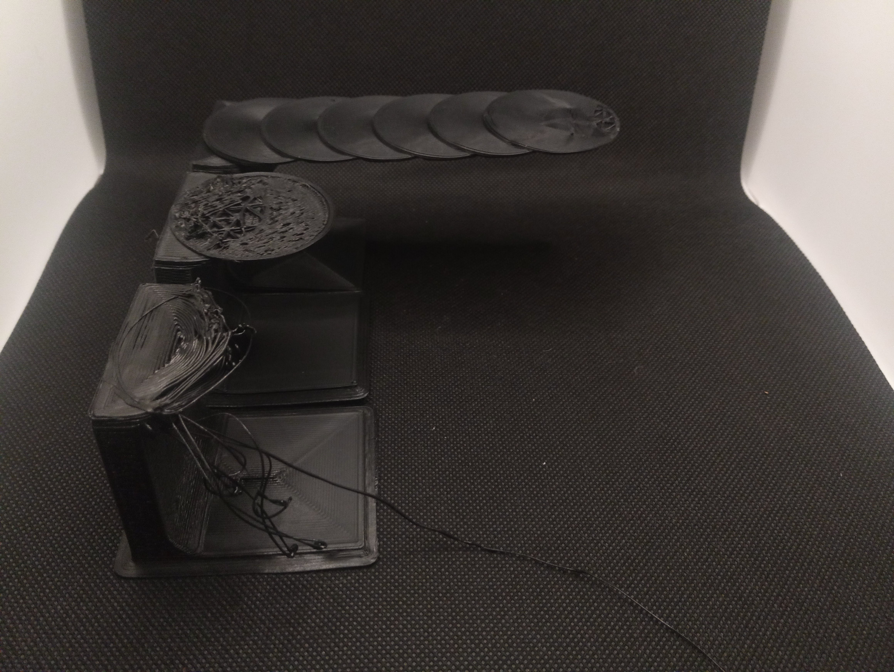
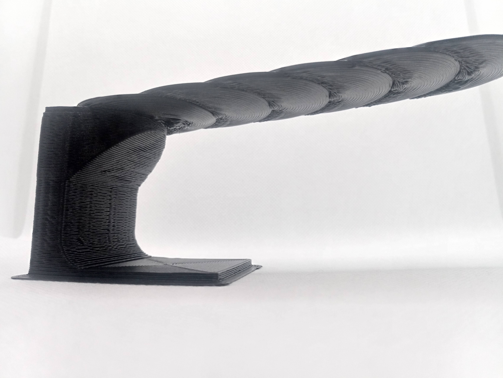
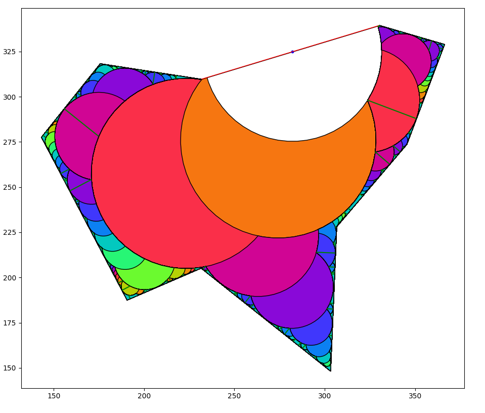

# Arc Overhang

A 3D printer slicing algorithm that lets you print 90° overhangs without support material. I hope to turn this into a standard feature in 3D printing slicers.

This is what the algorithm looks like: 


## 1. Brief Explanation
To understand how this works, you need to know 3 things:  

1. You can print 90° overhangs by wrapping filament around itself in concentric **arcs**. You may have seen the [fullcontrol.xyz overhang challenge](https://fullcontrol.xyz/#/models/b70938). This uses the exact same principle.



Here's what this effect looks like while printing:  


2. You can start an **arc** on an **arc** .



3. Recursively print **arcs** until the space is filled. This can be used to print almost any artibtrary shape:
   


I've printed ridiculously large overhangs using this method:



## 2. Background

Earlier this year, I accidentally discovered you can print an overhang that supports itself. I was just messing around with printing into thin air to see what happens. Here's the print that started it all: 


Then I tried to recreate the effect on purpose



And fine tune it: 




## 3. Packages

I programmed this in Python 3. 

Packages used are:
- [shapely 1.8.5](https://shapely.readthedocs.io/en/stable/) for many useful 2D shape and geometry tools.
- [geopandas](https://geopandas.org/en/stable/index.html) and [matplotlib](https://matplotlib.org/) for plotting
- [numpy](https://numpy.org/) for math stuff

### 4. How it Works



1. **Load a polygon**. This program just generates a random shape as an example. Random shapes also helped me find unusual edge-cases while testing.
   
2. **Choose an edge to start from**. I arbitrarily set the program to always choose the longest edge as the starting edge (the red line).

3. **Create the largest arc possible**. The center of that arc must reside on the starting line. The white arc is the first arc.

4. **Recursively create arcs on arcs** until the next arc would be smaller than some threshold amount. Default is half of the 3D printed line width. One arc may end up branching into two or more. The 2nd arc is the **orange** arc, and it branches into **two red** arcs. The colors in the image represent the recursion depth.

5. **Turn those arcs into gcode** Mainly just turning coordinates into strings using string formatting.

## 5. Gcode Generation

This program also generates a demonstration tower so that it is easy to print this for yourself.


## 6. Suggested Print Settings

There are a few rules of thumb for actually printing this stuff: 

The overhang print quality is greatly improved when the material solidifies as quickly as possible. Therefore:

1. **Print as cold as possible.** I used 195 degrees for PLA. You can probably go even lower. If you require higher temp for the rest of the print, I'm sure slicers could insert some temp-change gcode before and after this algorithm occurs. Might waste a lot of time though.
   
2. **Maximize cooling.** Set your fans to full blast. I don't think this technique will work too well with ABS and materials that can't use cooling fans, but I haven't tested it.
3. **Print slowly.** I use around 5 mm/s. Even that is too fast sometimes for the really tiny arcs, since they have almost no time to cool before the next layer begins.

## 7. Room for Improvement

This algorithm was implemented using a depth-first approach, where one branch grows as long as possible before splitting. I think it would be more reliable if done using a breadth-first approach where all the branches on a certain depth are created before moving one layer deeper. This method sounded more complicated though so I didn't do it.

## 8. Printer Compatibility

By default, the output gcode should print fine on most standard desktop FDM printers running Marlin firmware and a 0.4mm nozzle. If your bed is smaller than 150x150mm you'll want to adjust some settings to make sure the print fits inside the printable area. If you have a different size nozzle, search for `LINE_WIDTH` and adjust as necessary.

## 9. How to Install

If you want to try the prints without installing, I added some test print gcode files in the root directory that you can directly download. They should print fine on most printers although you may need to manually adjust the gcode so that it works with your printer.

1. Clone this repo to your computer
2. Install python 3 and required packages.

    ```
    python3 -m pip install -r requirements.txt
    ```

3. Check out the parameters at the top of `main.py` for print settings, and to change how the arcs are generated. 
4. Change the shape generation parameters to customize the shape, size, and spikiness of the random shape. Or create your own shape. It should work on any `Polygon`.
5. Double check the start and end gcode will work with your printer. 
6. Run the code.
7. Preview the gcode (found in the output folder) using [Repetier Host](https://www.repetier.com/download-now/)
8. Print it! If you get a successful print using this algorithm, I'd love to hear about it.


