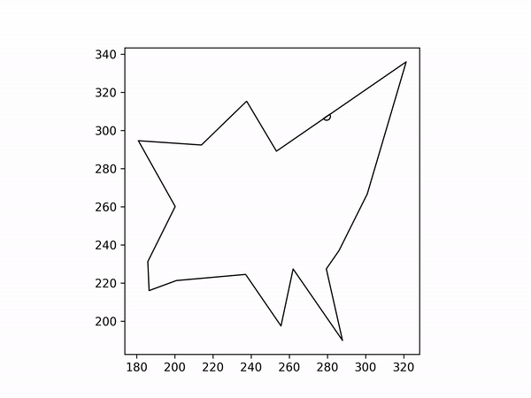

# Arc Overhang

A 3D printer toolpath generation algorithm that lets you print 90° overhangs without support material, original Idea by Steven McCulloch: https://github.com/stmcculloch/arc-overhang

**Now it is easy and convinient to use by to integrate the functionality into PrusaSlicer as a post-processing script.**

## 0. Videos

- Arc Overhang Initial Video: https://youtu.be/fjGeBYOPmHA
- CNC kitchen's video: https://youtu.be/B0yo-o47688
- Steven's Instagram: https://www.instagram.com/layershift3d/

This is a basic visualisation how the algorithm works: 

(this visualisation uses depth first generation, the current version uses breadth first search algorithm to fill the remaining space in the overhang.
## 1. Brief Explanation (from Steven McColloch):

1. You can print 90° overhangs by wrapping filament around itself in concentric **arcs**. You may have seen the [fullcontrol.xyz overhang challenge](https://fullcontrol.xyz/#/models/b70938). This uses the exact same principle.

Here's what this effect looks like while printing:  

2. You can start an **arc** on an **arc** to get ridiculously large overhangs.
To get perfect results you need to tune the process to fit your machine. Also it is painfully slow, but still faster than support + removal :P

For more details visit: https://github.com/stmcculloch/arc-overhang
## 3. Setup-Process
1. download and install Python 3, at least Version 3.5, check the "add to PATH" box during the installation.
2. install the librarys [shapely](https://shapely.readthedocs.io/en/stable/), [numpy](https://numpy.org/) and [matplotlib](https://matplotlib.org/) via "python -m pip install "+library-name in your console (type cmd in start-menu search).
3. Ready to go!

## 4. How to use it:
#### Option A) via Console
Simply open your system console and type 'python ' 
followed by the path to this script 
and the path of the gcode file. Will overwrite the file.
#### Option B) use it as a automatic post-processing script in PrusaSlicer
1. open PrusaSlicer, go to print-settings-tab->output-options. Locate the window for post-processing-script. 
2. In that window enter: full-path-to-your-python-exe full-path-to-this-script-incl-filename
3. PrusaSlicer will execute the script after the export of the Gcode, therefore the view in the window wont change. 
4. Open the finished gcode file to see the results.

Notes to nail it first try:
If the python path contains any empty spaces, mask them as described here: https://manual.slic3r.org/advanced/post-processing

If you want to change generation settings: Open the Script in an editor, scroll to 'Parameter' section. Settings from PrusaSlicer will be extracted automaticly from the gcode.

## 5. Current Limitations
1. Currently deletes all Bridge Infills if an Arc in Layer. Fixing in Progress.
2. If there are bridged, that shall not be Arc-filled, the conversion failes, try cutting them away (slice only the arc layers and inject into gcodefile) until there is a proper fix.
2. Code is slow on more complicated models, but is not optimized for speed yet.
3. The Arcs are extruded very thick, so the layer will be 0.1-0.5mm thicker (dependend on nozzle dia) than expected
=>if precision needed make test prints to counter this effect.
4. Heavy warping, locking for way to fix it. Message me or Steven if you have an Idea :)

## 6. Suggested Print Settings
Some PrintSettings will be checked and warned if "wrong".

There are a few rules of thumb for actually printing this stuff: 

The overhang print quality is greatly improved when the material solidifies as quickly as possible. Therefore:
0. **Currently necessary PrusaSlicer Settings** :only 1 bottom layer, infill above arcs 70% hilbert curve or none , important to reduce warping. Use height modifier or modifier-mesh in the area. Thin layers also help.
  
1. **Print as cold as possible.** I used 190 degrees for PLA. You can probably go even lower. If you require higher temp for the rest of the print, you could insert could insert some temp-change gcode before and after the arcs are printed. Might waste a lot of time though.
   
2. **Maximize cooling.** Set your fans to full blast. I don't think this technique will work too well with ABS and materials that can't use cooling fans, but I haven't tested it.
3. **Print slowly.** I use around 2 mm/s. Even that is too fast sometimes for the really tiny arcs, since they have almost no time to cool before the next layer begins.

## 7. Room for Improvement
We would be happy if you contribute!
Currently the biggest issue is severe warping, when the infill layers above are printed. Suggestions?

Further optimize the settings or make the use more convinient. 
You could prevent warping by automaticly slowing down in the next few layers (eg 2mm).
You could make the algorithm hole tolerant, is a little complicated though.
Feel free to give it a try!

## 8. Printer Compatibility

By default, the output gcode should print fine on most standard desktop FDM printers you can use with PrusaSlicer. PrusaSlicer is mandatory as the script listens to sepcific keywords....

## 9. Easy Way to try Out

If you want to try the prints without installing, Steven and I added some test print gcode files in the root directory that you can directly download. They should print fine on most printers although you may need to manually adjust the gcode so that it works with your printer.

## 10. Print it! 
If you get a successful print using this algorithm, I'd (and I am sure Steven to) love to hear about it.
